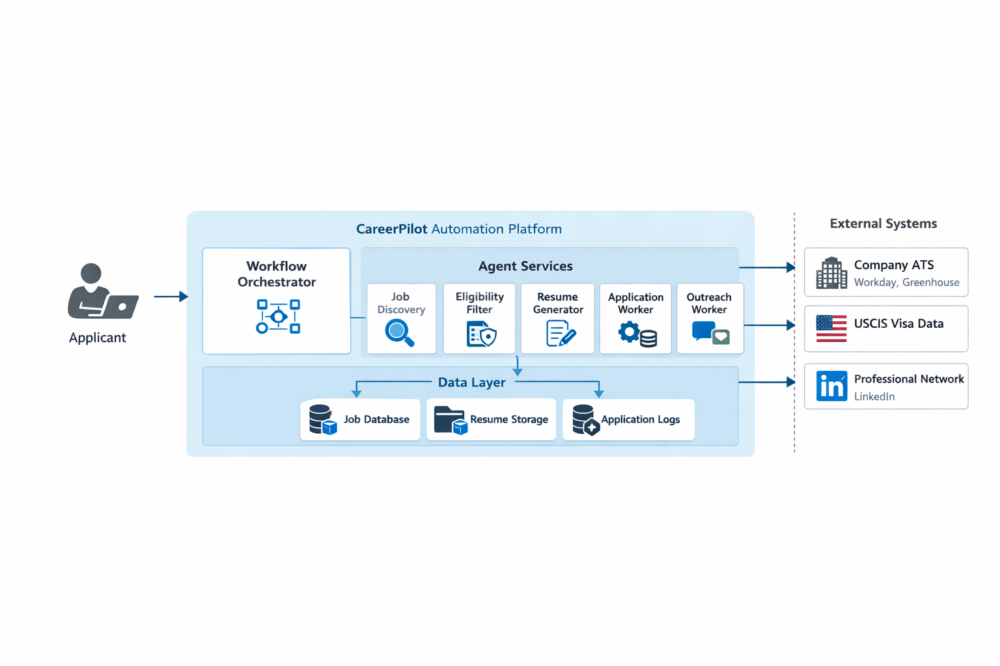

# 🚀 CareerPilot: Autonomous Job Application Platform

An industrial-grade, multi-agent AI automation system designed to discover, filter, and autonomously apply for Software Engineering and AI/ML roles. CareerPilot integrates intelligent scraping, strict compliance formatting, and robotic process automation (RPA) to streamline the job search process, with a specialized focus on verifying H1B transfer eligibility.

## 🏗️ System Architecture

The platform operates on a **Manager-Worker (Orchestrator)** pattern, separating execution logic from the data layer for high scalability and reliability.

### 1. Workflow Orchestrator
The central control plane that maintains the global state of the application process. It manages task delegation, agent hand-offs, and error recovery, ensuring a job lead isn't dropped mid-process.

### 2. Agent Services
A cluster of specialized microservices, each handling a distinct phase of the pipeline:
* **Job Discovery (Scout):** Continuously scrapes targeted company ATS platforms (Workday, Greenhouse, etc.) for open technical roles matching specific constraints.
* **Eligibility Filter (Intel):** Cross-references job requirements and company history with USCIS Visa Data to calculate the probability of H1B sponsorship success before proceeding.
* **Resume Generator (Architect):** Dynamically reconstructs the applicant's resume based on the parsed Job Description. Enforces strict bolding of required technical skills and simulates ATS parsers to guarantee high match scores.
* **Application Worker (Pilot):** Utilizes RPA and DOM parsing to physically execute the application submission on external career pages, utilizing human-emulation delays to bypass bot detection.
* **Outreach Worker (Networker):** Triggers post-submission workflows to identify and message relevant technical recruiters or hiring managers via LinkedIn.

### 3. Data Layer
Persistent storage ensuring full traceability of the automation pipeline:
* **Job Database:** Logs all discovered roles, metadata, and sponsorship probability scores.
* **Resume Storage:** Archives the exact tailored PDF generated for every specific application.
* **Application Logs:** Tracks submission IDs, timestamps, and outreach status.

## 🛠️ Technology Stack (Proposed)
* **Orchestration:** LangGraph / CrewAI
* **Scraping & Emulation:** Playwright, Browserbase, Anthropic Computer Use API
* **Data Processing:** Python, Pydantic (JSON validation)
* **Document Generation:** LaTeX Compiler API
* **Memory/Database:** PostgreSQL / Pinecone (Vector Search)

## 🎯 Core Features
- **Zero-Waste Sourcing:** Automatically discards "Ghost Jobs" or roles from companies with low visa approval histories.
- **Dynamic ATS Optimization:** Never submits a generic resume; every PDF is compiled specifically for the target Job ID.
- **Hands-Free Execution:** Navigates complex, multi-page application forms (including default EEOC/Diversity disclosures) autonomously.

---
*Designed to engineer luck in the modern hiring landscape.*
